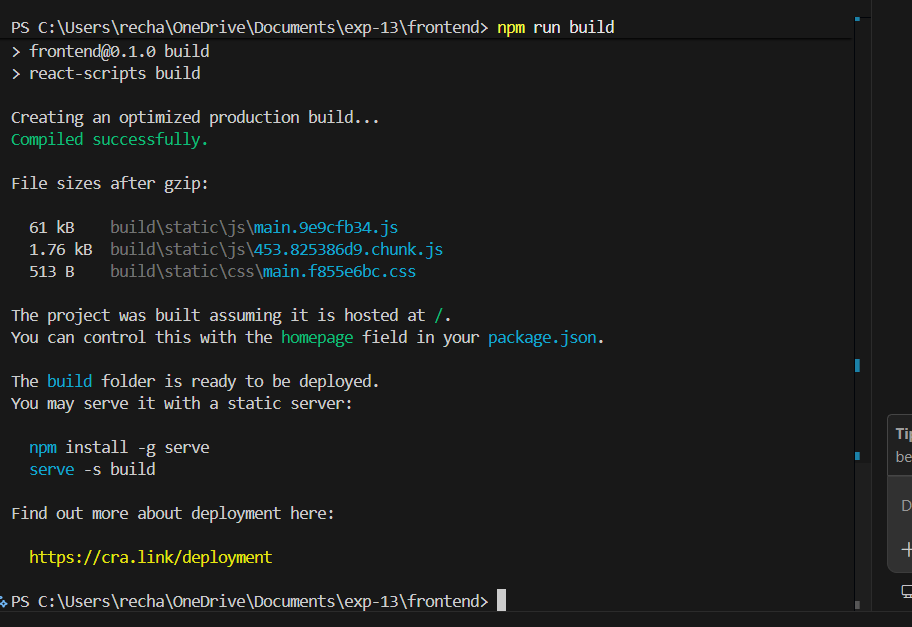
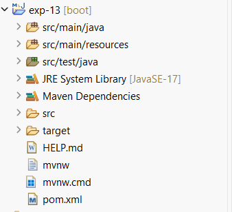
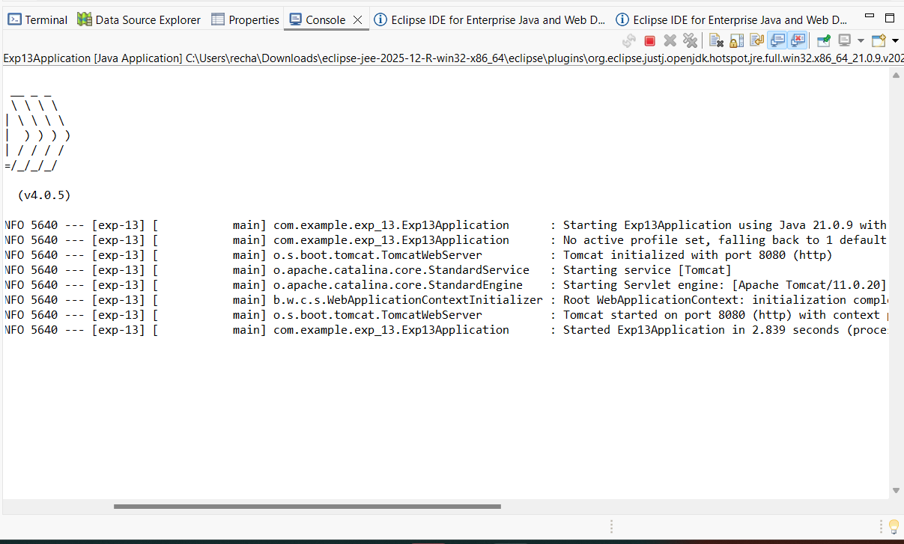
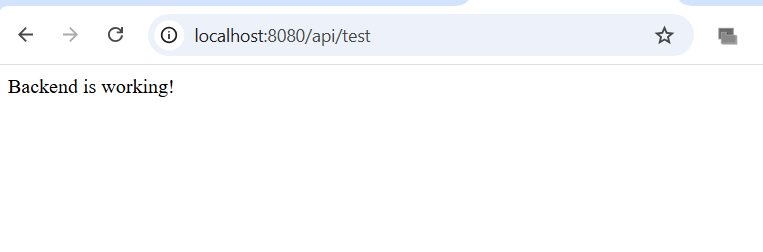
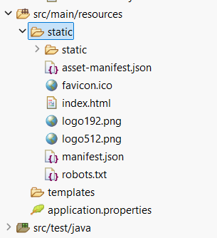
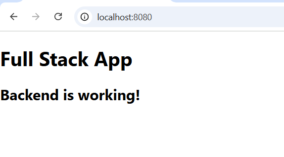

# Deployment of Full-Stack Application (Spring Boot + React)

## 👤 Student Details

**Name:** Rebekah Meda
**Registration Number:** 2400032563

---

## 🎯 Aim

To deploy a production-ready full-stack application using React and Spring Boot.

---

## 🧰 Tools Used

* React.js
* Spring Boot
* Eclipse
* VS Code
* Maven

---

## 🚀 Procedure with Screenshots

---

### 🔹 Step 1: React Build

Command used:

```
npm run build
```

📸 Screenshot:


---

### 🔹 Step 2: Spring Boot Project Creation

📸 Screenshot:


---

### 🔹 Step 3: Controller Code

```java
@RestController
public class TestController {
    @GetMapping("/api/test")
    public String test() {
        return "Backend is working!";
    }
}
```

📸 Screenshot:


---

### 🔹 Step 4: Backend Running

📸 Screenshot:


---

### 🔹 Step 5: API Output

URL:

```
http://localhost:8080/api/test
```

📸 Screenshot:


---

### 🔹 Step 6: Static Folder Integration

📸 Screenshot:


---

### 🔹 Step 7: Final Output

URL:

```
http://localhost:8080
```

📸 Screenshot:


---

## ✅ Result

The full-stack application was successfully deployed and tested.

---

## 📌 Conclusion

Frontend and backend were integrated successfully using Spring Boot static deployment.

---
